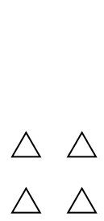

# Boids

Boids is a work in progress Haskell implementation of boids [1].
Boids attempt to model groups of natural actors, like fish and birds,
in a realistic seeming way. The package provides a small DSL for
defining different boid behaviours as well as functionality for
rendering flocks of boids as GIF files.

## Basic transformations

We start with the most basic transformation of all, `remain`.
This transformation makes boids keep their current velocity

The next transformation is `cohesion`, which makes boids want
to come together to the same position

Boids can also be made to avoid each other using `avoidance`

Combining two transformations can be done using `<+>`

`align <+> cohesion`.

Using `upto` the degree to which a certain transformation contributes
to the behaviour of the boids can be controlled

`align <+> cohesion <+> avoidance `upto` 0.5`

## Future work
Currently, the library only supports modelling "flocking" like behaviour. 
But [2] indicates that a future direction for the project could include
optimization problems and modelling decision procedures in groups of stakeholders.

## References
\[1\] [Flocks, Herds, and Schools: A Distributed Behavioral Model](http://www.red3d.com/cwr/papers/1987/boids.html)

\[2\] [A review of particle swarm optimization. Part I: background and development](http://sci2s.ugr.es/sites/default/files/files/Teaching/GraduatesCourses/Metaheuristicas/Bibliography/A05%20-%20A-review-of-particle-swarm-optimization-PartI.pdf)
