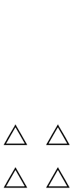
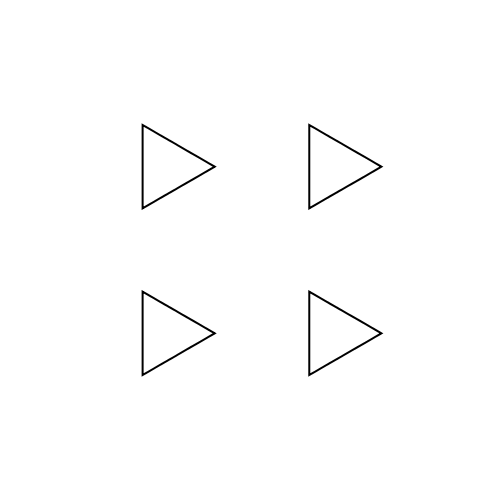
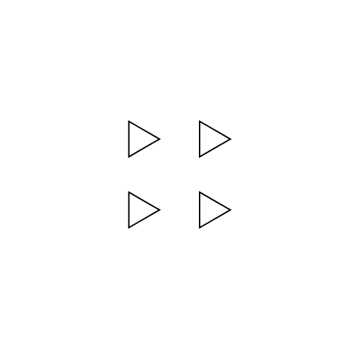
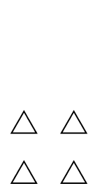

# Boids

Boids is a work in progress Haskell implementation of boids [1].
Boids attempt to model groups of natural actors, like fish and birds,
in a realistic seeming way. The package provides a small DSL for
defining different boid behaviours as well as functionality for
rendering flocks of boids as GIF files.

## Basic transformations

We start with the most basic transformation of all, `remain`.
This transformation makes boids keep their current velocity

The next transformation is `cohesion`, which makes boids want
to come together to the same position

Boids can also be made to avoid each other using `avoidance`

Combining two transformations can be done using `<+>`,
as has been done in the following example of `align <+> cohesion`.

# References
\[1\] [Flocks, Herds, and Schools: A Distributed Behavioral Model](http://www.red3d.com/cwr/papers/1987/boids.html)
